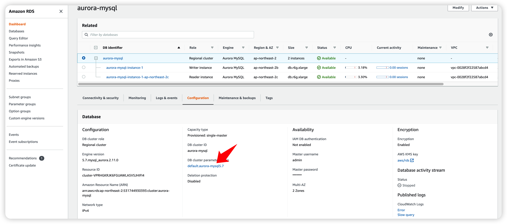
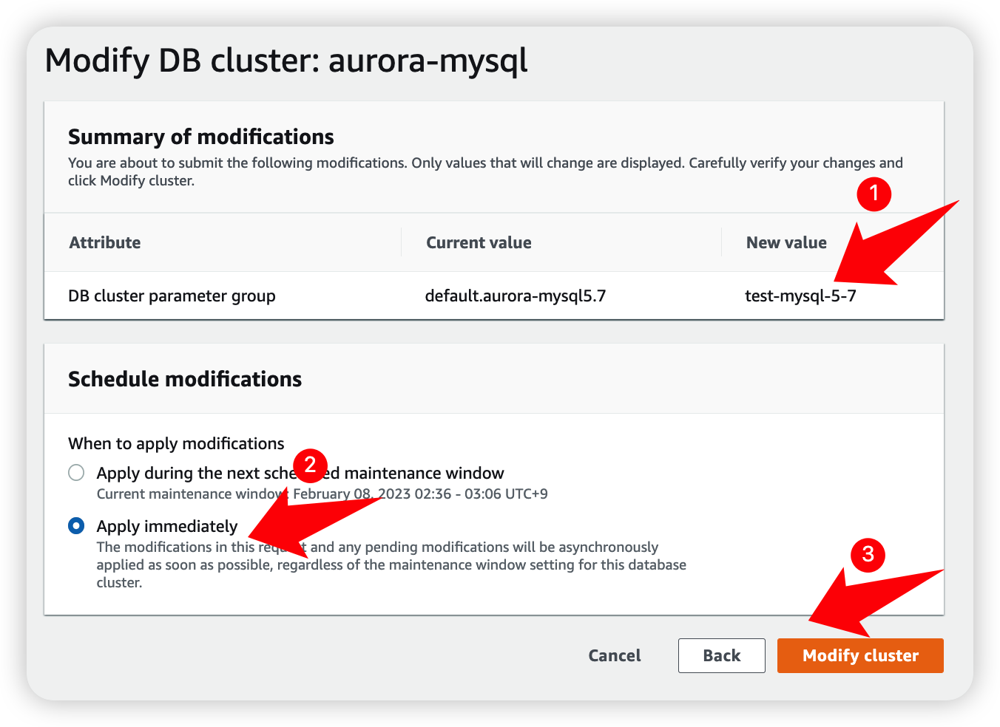

# 1. 목적
RDS/Aurora의 Slow Query 을 탐지하여 slack 을 통해 알림을 받는다.

# 2. 주의 사항
일반적으로 RDS/Aurora에서 Slow Query 를 Enable 하는 과정에서 downtime이나 지연은 발생하지 않으나 운영 환경의 경우에는 영향도가 적은 배포 시간이나 traffic이 적은 시간에 진행하시길 바랍니다

  

# 3. Aurora

## 1. Slow Query Enable
Aurora의 Slow Query 를 활성화 합니다.
1. Aurora 의 cluster 를 클릭
2. Modify 선택 

`Additional configuration`섹션의 `Log exports` 에서 `Slow query log`를 체크합니다. ( 운영 안전성을 위해 Error log 와 Audit log를 체크하여 사용하는 것이 좋습니다. ) 
그리고 가장 하단의 `Continue` 버튼을 클릭합니다.

1. Slow query log 가 선택되어 있는 것을 확인하고
2. Modify Cluster 를 클릭합니다.

Aurora의 Staus 가 modify -> configuring-log-exports -> Available 될 때까지 기다립니다.

Configuration 탭에서 Slow query 가 활성화 되었는지 확인합니다.
1. Aurora 클러스터를 클릭
2. Configuration 탭 클릭
3. Slow query 확인

파라메터 그룹을 통해 Slow Query 상세 설정을 합니다.
1. DB Cluster parameter group을 확인합니다. 캡처 처럼 default.% (default.aurora-mysql5.7) 로 되어 있을 경우 별도의 파라페터 그룹을 생성하여 교체해주어야 합니다.

default.% 사용하고 있으므로 새로운 parameter group을 생성합니다.
1. Parameter group 클릭
2. Create parameter group 클릭

1. 사용하고 있는 default.aurora-mysql5.7 에서 default를 제외하고 `aurora-mysql5.7` 를 선택합니다.
2. DB Cluster Prameter Group을 선택합니다.
3. `test-mysql-5-7` 을 입력합니다.
4. 적절한 명을 입력합니다.
5. Create 을 클릭합니다.

Aurora의 parameter group을 방금 생성한 group으로 변경합니다.
1. database 클릭
2. aurora 클러스터 클릭
3. Modify 클릭

`Additional configuration` 섹션의 `Database options` 에서 방금 생성한 `test-mysql-5-7`을 선택합니다. 
하단의 `Continue`를 클릭합니다.

1. `test-mysql-5-7`로 변경된 것을 확인
2. `Apply immediately` 를 선택
3. `Modify Cluster` 클릭

1. Cluster parameter group을 변경 했으므로 각 인스턴스에 적용이 됩니다. 인스턴스 클릭
2. 변경 중임으로 확인합니다. Applying -> In sync

cluster parameter group 의 관련 파라메터를 변경합니다.
1. Parameter group 선택
2. `test-mysql-5-7` 를 클릭

Edit Parameters 를 클릭한 후 아래 파라메터를 변경합니다.
- slow_query_log : 1
- general_log : 1
- long_query_time : 3 (3초 이상만 수집, 요구사항에 따라 변경)
- log_output : FILE  

모두 변경한 후 `Save changes` 을 클릭합니다.

3초 이상 SQL 을 실행하여 Slow Query 로깅이 되는지 확인합니다.
- 3초 이상 SQL 실행

- LOG 확인

- 3초 이상 실행된 SQL 이력 확인

